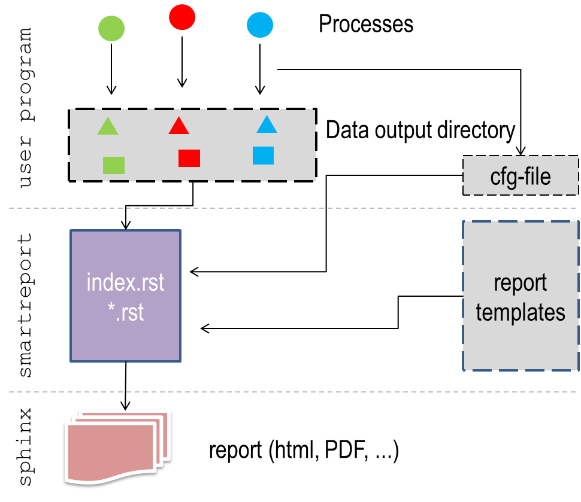

Introduction
============

`easyreport` is a template based engine to generate reports in multiple output formats based on very flexible input. The following figure gives an overview about the gernal structure.

Let us assume that you have a program which produces a lot of figures, statistics and other output. You want to present these results in a nice way and have full flexibility to allow for different output formats, like e.g. HTML, PDF and others. One solution to this might be that you generate your output directly from your program. Fine with that. Tools like e.g. <`markup.py` http://markup.sourceforge.net/>_ are very helpfull here.

However, could you imagine that the results of your code are also coming from *parallel processes*? If so, then generating a report from these results would be quite difficult in the end.

`easyreport` aims to completely separate the processing and the actual reporting. You can use it in a flexible way to generate reports based on arbitrary output. As it is based on templates it is highly customizable.

Objective
---------

Major objectives are

* support reporting based on results from parallel processing
* support user based templates for customized report generation
* allow for flexible integration of report generating engines like e.g. Sphinx to maximize flexibility in output formats
* separate as much as possible the content from the actual format
* independency from code which generate the output

Philosophy
----------

To achieve the above objectives, `easyreport` uses templates and separates the content and the format. The main steps to be undertaken when generating a report from arbitrary output are

1. gather information from in output directory
2. structure this information based on user template
3. generate report in user defined output format

Implementation
--------------

The only interface which is needed for `easyreport` is an ASCII file written by the user programm in `YAML <http://pyyaml.org/wiki/PyYAML>`_ format. A sample ipython notebook, showing some basic functionality is provided in the repository and can be viewed online `here <http://nbviewer.ipython.org/github/pygeo/easyreport/blob/master/generate_example.ipynb>`_.

The basic components are:

* the data generated by the user programs (all need to be written in a single directory)
* an interface file which specifies arbitrary fields for the data. This needs to be written in YAML format and tells is required to specify the *content*.
* user templates: these are plain ASCII files which can contain python based variables and control structures following the syntax of `makotemplates <http://www.makotemplates.org/>`_.

Installation
------------

Prerequesites
~~~~~~~~~~~~~

* `makotemplates <http://www.makotemplates.org/>`_
* `Sphinx <http://sphinx-doc.org/>`_
* python 2.7 (python 3.x not tested, please report if it works)

Installation steps
~~~~~~~~~~~~~~~~~~

So far only cloning from the repository has been tested::

    git clone git@github.com:pygeo/easyreport.git

Execution has been tested so far also only from the development directory

Example
-------

Let's give first an application example. Let's say you have a program, which you runs three processes (A,B,C) in parallel. All the processes are writing output (graphics, statistics) to a particular output directory.

Thus in the end you end up with something like this::

    /<some dir>/
               /A1.png
               /B1.png
               /C1.png
               /A1.gif
               /B1.gif
               /C1.gif
               /a.csv
               /b.csv
               /c.csv

You end up with lots of files, some of them are graphics, some of them are textfiles. What a mess, how could you structure and present your results? You need an *easy* way to do that. Here you go.

Define a template
~~~~~~~~~~~~~~~~~

Let's say you want your results to be organized in `restructured text <http://en.wikipedia.org/wiki/ReStructuredText>`_ syntax (In principle it could be any format that can be written in a plain ASCII file). What you would typically do is to write a report yourself as follows::

    Result A
    --------
    blablablabla blabla blabla

    .. figure:: images/A1.png
       :scale: 50 %

       This is the caption of figure A1.png

    blablabla

    statistic a.csv here

    blablabla

    .. figure:: images/A1.gif
       :scale: 50 %

       This is the caption of figure A1.gif

    Result B
    --------
    blablablabla blabla blabla

    .. figure:: images/B1.png
       :scale: 50 %

       This is the caption of figure B1.png

    blablabla

    statistic b.csv here

    blablabla

    .. figure:: images/B1.gif
       :scale: 50 %

       This is the caption of figure B1.gif

Let us now assume that you have not results from 3 operations, but from 20 or even more. Wouldn't it be nice to have some more automated approach to the report generation, which gives you nevertheless the flexibility to easily adapt the look-and-feel? Let's make a template from the above::

    Result <VARIABLE A>
    --------
    blablablabla blabla blabla

    .. figure:: <SOME A FILE>
       :scale: 50 %

       <<VAR.files.northern.file>>

    blablabla

    statistic <SOME STAT FILE> here

You see that we have replaced in the above code some of the content by variables, which are indicated by tags. `easyreport` follows the syntax of `makotemplates <http://www.makotemplates.org/>`_ to specify these tags.

**Recipie to generate a template**

1. write the text like you would do it by hand
2. replace components which you like to be flexible by hand
3. define sections on which you would like to have itteration capabilities by adding controling structures based on the `makotemplate syntax <http://www.makotemplates.org/>`_.

An example for a proper working template file is provided `here <https://github.com/pygeo/easyreport/blob/master/albedo_template.rst>`_.

Define the interface
~~~~~~~~~~~~~~~~~~~~

An example for a working interface file working with the above template looks like::

    models:
    - MPI-ESM-LR:
        graphic1: MPI-ESM-LR.png
        graphic_test: MPI-ESM-LR.jpg
        observations:
        - GlobSnow:
            caption: This is a testcaption using model MPI-ESM-LR and observation GlobSnow
            file: difference_MPI-ESM-LR_GLOBSNOW.png
        - GlobAlbedo:
            caption: This is a testcaption using model MPI-ESM-LR and observation GlobAlbedo
            file: difference_MPI-ESM-LR_GLOBALBEDO.png
        - CCI-Aerosol:
            caption: This is a testcaption using model MPI-ESM-LR and observation CCI-Aerosol
            file: difference_MPI-ESM-LR_CCI-AEROSOL.png
    - GFDL:
        graphic1: GFDL.png
        graphic_test: GFDL.jpg
        observations:
        - GlobSnow:
            caption: This is a testcaption using model GFDL and observation GlobSnow
            file: difference_GFDL_GLOBSNOW.png
        - GlobAlbedo:
            caption: This is a testcaption using model GFDL and observation GlobAlbedo
            file: difference_GFDL_GLOBALBEDO.png
        - CCI-Aerosol:
            caption: This is a testcaption using model GFDL and observation CCI-Aerosol
            file: difference_GFDL_CCI-AEROSOL.png

Note that if you want to preserve the order of entries, you need to specify lists!

